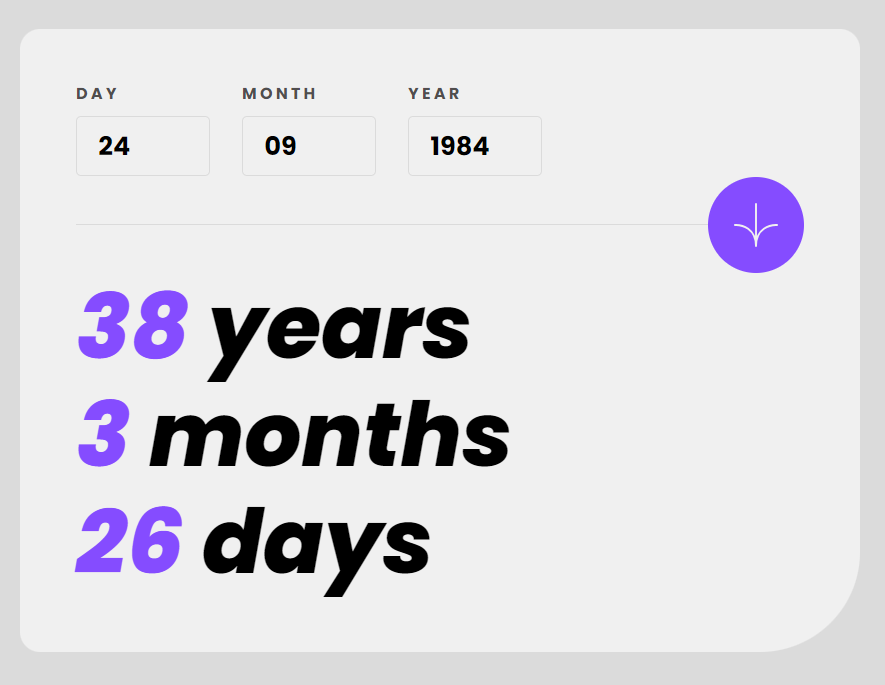
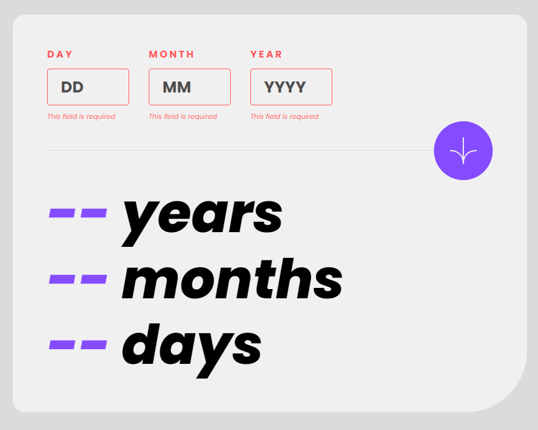
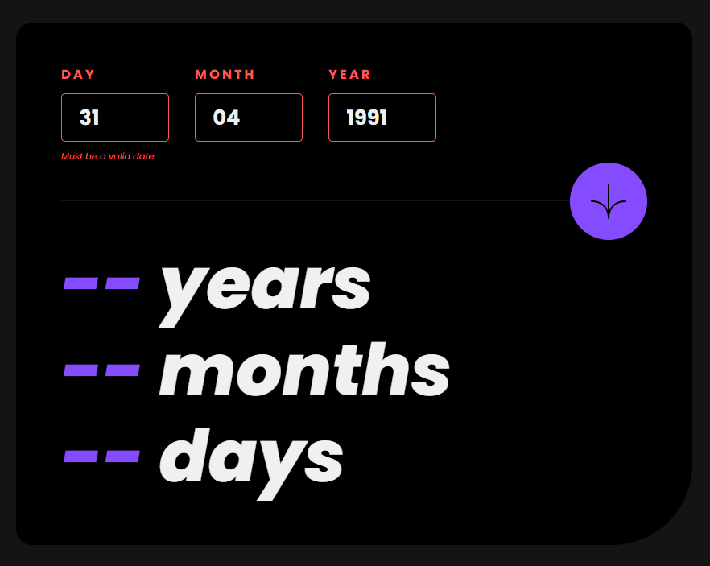
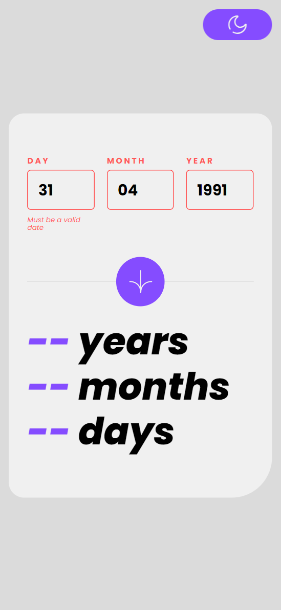

# Frontend Mentor - Age calculator app 

This is a solution to the [Age calculator app challenge on Frontend Mentor](https://www.frontendmentor.io/challenges/age-calculator-app-dF9DFFpj-Q). Frontend Mentor challenges help you improve your coding skills by building realistic projects.

## Table of contents

- [Overview](#overview)
  - [The challenge](#the-challenge)
  - [Screenshot](#screenshot)
  - [Links](#links)
- [My process](#my-process)
  - [Built with](#built-with)
- [Author](#author)

## Overview

### The challenge

Users should be able to:

- View an age in years, months, and days after submitting a valid date through the form
- Receive validation errors if:
  - Any field is empty when the form is submitted
  - The day number is not between 1-31
  - The month number is not between 1-12
  - The year is in the future
  - The date is invalid e.g. 31/04/1991 (there are 30 days in April)
- View the optimal layout for the interface depending on their device's screen size
- See hover and focus states for all interactive elements on the page
- **Bonus**: See the age numbers animate to their final number when the form is submitted

### Screenshot

### Links

- Solution URL: [Github URL](https://github.com/devatorres/frontend-mentor-age-calculator-app)
- Live Site URL: [Live URL](https://gorgeous-starburst-788b67.netlify.app/)

## My process

### Built with

- Prettier
- TypeScript
- Clean Code
- API
- Flexbox
- Responsive
- [React](https://reactjs.org/) - JS library
- Vite
- Date-fns
- YUP
- Zustand
- React hook form

### What I learned

Using React countup.

## Author

- Instagram - [@atorres.dev](https://www.instagram.com/atorres.dev)
- Frontend Mentor - [@devatorres](https://www.frontendmentor.io/profile/devatorres)
- Github - [@devatorres](https://github.com/devatorres)
- Codepen - [@devatorres](https://codepen.io/devatorres)
- LinkedIn - [@devatorres](https://www.linkedin.com/in/devatorres)
